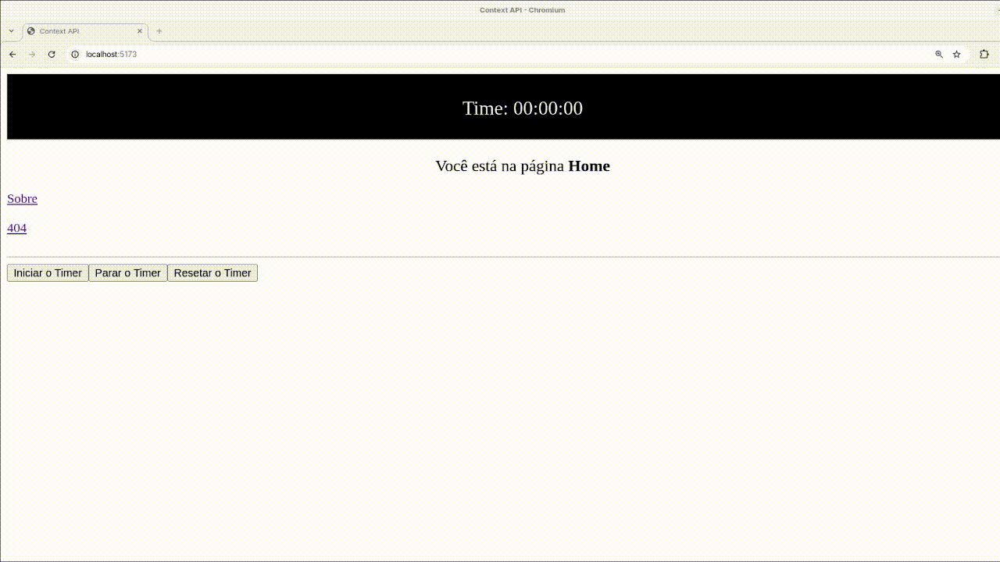

# Estado-Global-Playground
Projeto de estudo sobre gerenciamento de estado global em React, utilizando Context API e Redux. Ambos os projetos seguem a mesma lógica central, com pequenas variações na implementação (o objetivo é o mesmo em ambos os casos).

# Objetivo
Permitir que o cronômetro funcione de forma integrada entre páginas, com as seguintes funcionalidades:
- Iniciar, pausar e resetar o cronômetro.
- Manter a contagem ao navegar entre páginas (Home, Sobre e 404).
- Garantir que cliques repetidos no botão não disparem múltiplas execuções simultâneas do mesmo comando.

# Demonstração
